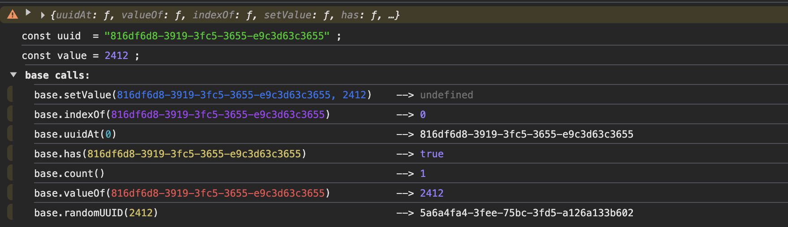

# turbouuid

Fast UUID generator / an alternative for `crypto.randomUUID`.

Designed for performance-critical applications, `turbouuid` uses a pre-allocated buffer strategy to generate UUIDs significantly faster than the native implementation.

## Performance

Benchmarks ran on 1,000,000 iterations show a massive performance gain:

-   **crypto.randomUUID**: ~1138ms
-   **turbouuid**: ~426ms

🚀 **~2.6x faster** than the native solution.

## Usage

The library attaches directly to `window.randomUUID` for browser environments.

```javascript
require('turbouuid');

// Returns a standard v4-like UUID string
console.log(window.randomUUID());
// Output example: f1235820-f090-3fce-a0d6-af6e26c6a0d6
```

## SIMD-Accelerated In-Memory Storage

`turbouuid` now includes a high-performance, WebAssembly-based storage engine for managing UUIDs in memory. It leverages **128-bit SIMD** instructions to perform lightning-fast lookups and storage operations.



### Key Features

*   **⚡ SIMD-Powered Search**: Uses `v128` vector instructions to scan memory in parallel, offering incredibly fast `indexOf` and `has` checks.
*   **🔗 Key-Ref Association**: Map each UUID to a 32-bit integer (e.g., a database ID or object reference) for efficient lookups (`uuid -> id`).
*   **🧠 Zero-GC Overhead**: Operates on shared memory pages, bypassing the JavaScript garbage collector for stable, high-throughput performance.

### API Reference

To use the storage engine, initialize it via `turboUUID.base()`:

```javascript
const store = await turboUUID.base();
```

#### `store.randomUUID(value: number): string`
Generates a new UUID, stores it in memory, and associates it with the given `value`. Returns the generated UUID string.

#### `store.uuidAt(index: number): string`
Returns the UUID string stored at the specific memory index.

#### `store.indexOf(uuid: string): number`
Returns the memory index of the given UUID. Returns `-1` if not found.
*Powered by SIMD for checking multiple bytes per cycle.*

#### `store.has(uuid: string): boolean`
Checks if the UUID exists in the storage. Returns `1` (true) or `0` (false).

#### `store.valueOf(uuid: string): number`
Returns the integer value associated with the given UUID. Returns `0` if the UUID is not found.

#### `store.setValue(uuid: string, value: number): void`
Updates or sets the integer value associated with an existing UUID. If the UUID doesn't exist, it creates a new entry.

#### `store.remove(uuid: string): void`
Removes the UUID and its associated value from the storage.

#### `store.count(): number`
Returns the total number of UUIDs currently stored.

#### `store.forEach(callback: (uuid, value, index) => void): void`
Iterates over all stored UUIDs.
*Note: The callback receives the UUID string, the associated value, and the index.*

## How It Works

Instead of re-allocating memory for every generation, `turbouuid` reuses a set of TypedArrays (`Float64Array`, `Uint32Array`, `Uint16Array`, `BigUint64Array`) sharing the same buffer. This minimizes garbage collection overhead and maximizes throughput.

## License

MIT
